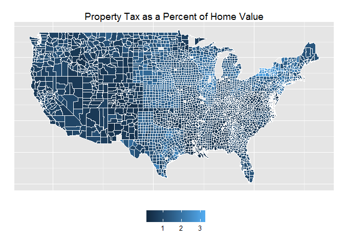
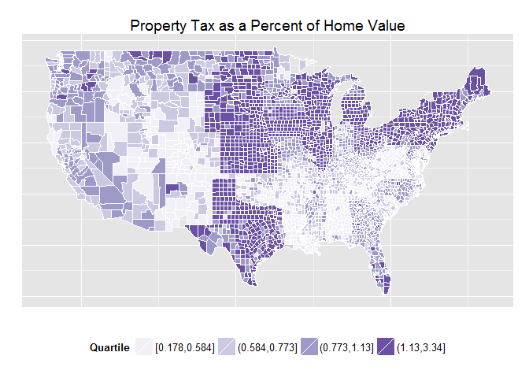

# Property Tax Burden Map
by Mike Silva  
August 26, 2015  


Data for this map comes from the U.S. Census Bureau's American Communicy Survey (ACS). Specifically tables B25077 - Median Home Value and B25103 - Mortgage Status by Median Real Estate Taxes Paid.  First we need to install and load the libraries needed for this project:


```r
install.packages("acs")
install.packages("dplyr")
install.packages("ggplot2")
install.packages("maps")
library(acs)
library(dplyr)
library(ggplot2)
library(maps)
```


Next we need to pull the data.  We are using the acs R package and have previously set up our api key using api.key.install.


```r
# Parameters
endyear <- 2012 # 2010 to 2012
span <- 5 # can be 1, 3 or 5

# Get counties and states
county.df=map_data("county")
names(county.df)[5:6]=c("state","county")
state.df=map_data("state")

# Grab ACS data
us.county <- geo.make(state="*", county="*")
B25077 <- acs.fetch(endyear, span, geography=us.county, table.number="B25077", col.names="pretty")
B25103 <- acs.fetch(endyear, span, geography=us.county, table.number="B25103", col.names="pretty")

# Compute property tax burden
df <- data.frame(county=geography(B25077)[[1]], median.home.value = estimate(B25077), prop.tax=estimate(B25103))
df <- df[,1:3]
df$Percent <- (df[,3]/df[,2])*100

# Create mapping data frame
choropleth <- df %>%
  mutate(county = gsub("Parish", "County", county)) %>%
  mutate(state = tolower(gsub("^.*County, ", "", county))) %>%
  mutate(county = tolower(gsub(" County,.*", "", county))) %>%
  merge(county.df, ., by=c("state","county")) %>%
  arrange(order) %>%
  mutate(Quartile = cut(Percent, breaks=quantile(Percent, probs=seq(0,1, by=0.25)), include.lowest=T))

# Map the raw burden
ggplot(choropleth, aes(long, lat, group=group)) +
  geom_polygon(aes(fill=Percent), colour = "white", size = 0.2) +
  geom_polygon(data = state.df, colour = "white", fill = NA) +
  theme(legend.position='bottom', legend.title=element_blank(),
        axis.ticks=element_blank(), axis.text=element_blank(),
        axis.title=element_blank()) +
  ggtitle('Property Tax as a Percent of Home Value')
```

 

```r
# Map quartiles
ggplot(choropleth, aes(long, lat, group = group)) +
  geom_polygon(aes(fill = Quartile), colour = "white", size = 0.2) + 
  geom_polygon(data = state.df, colour = "white", fill = NA) +
  scale_fill_brewer(palette = "Purples") + 
  theme(legend.position='bottom',
        axis.ticks=element_blank(), axis.text=element_blank(),
        axis.title=element_blank()) +
  ggtitle('Property Tax as a Percent of Home Value')
```

 

```r
# Counties with the highest burden
choropleth %>%
  select(state, county, Percent) %>%
  unique(.) %>%
  arrange(desc(Percent)) %>%
  head(.)
```

```
##      state   county  Percent
## 1 new york  orleans 3.342282
## 2 new york allegany 3.073964
## 3 new york    wayne 3.046083
## 4 new york   monroe 3.030551
## 5 new york cortland 3.022571
## 6 new york  niagara 3.013540
```

```r
# Counties with the lowest burden
choropleth %>%
  select(state, county, Percent) %>%
  unique(.) %>%
  arrange(Percent) %>%
  head(.)
```

```
##        state          county   Percent
## 1  louisiana  east feliciana 0.1781558
## 2 new mexico          catron 0.2207535
## 3  louisiana      assumption 0.2238470
## 4  louisiana       avoyelles 0.2322054
## 5  louisiana jefferson davis 0.2338425
## 6    alabama            bibb 0.2423581
```
